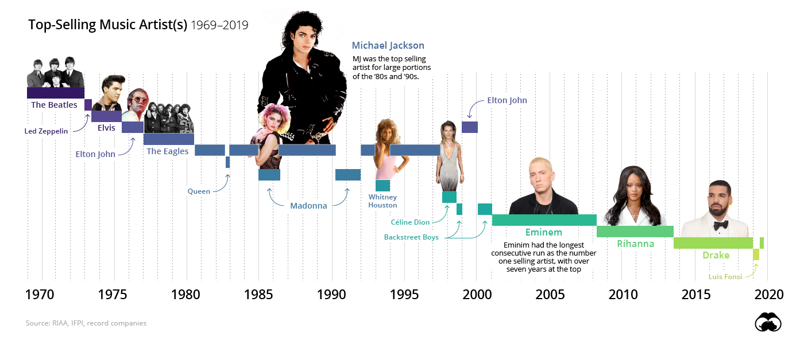

# 50-years-lyrics

50 Years of the Best-Selling Music Artists Lyrics Comparison

Modern Information Retrieval Course Assignment - Spring 2022

---

The art of music play an important role in the human world. Besides the instrumental aspect, lyrics and content of a music are also important. In this project, I will explore and compare the lyrics of the best-selling music artists in a 50 years period (from 1969 to 2019). This list is taken from [Visual Capitalist](https://www.visualcapitalist.com/chart-toppers-50-years-of-the-best-selling-music-artists/) website. They have also visualized this data in an awesome [video](https://www.youtube.com/watch?v=a3w8I8boc_I).

